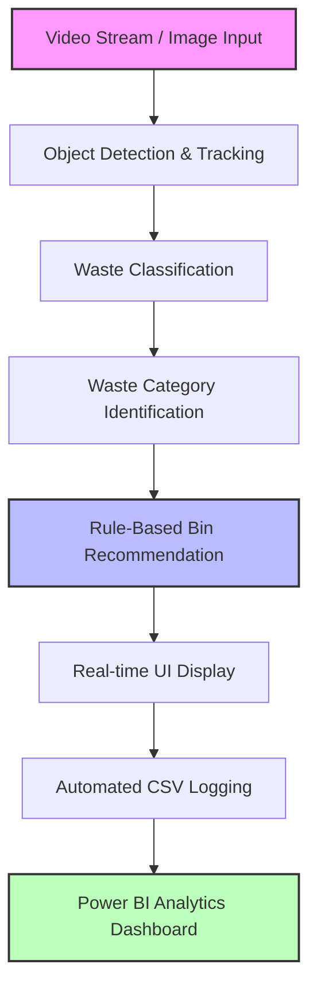

# Milestone 1: System Design

## 🏥 AI-Based Biomedical Waste Segregation & Monitoring System

This document outlines the core system architecture, camera deployment strategies, data model specifications, and classification rules for the automated hospital-grade biomedical waste monitoring system.

---

## 1. 📷 Camera Placement Strategy

### 🎯 Objective

To continuously monitor biomedical waste disposal areas and accurately identify:

* **Waste Type** (e.g., needle, glove, syringe)
* **Biomedical Waste Category** (e.g., Sharps, Contaminated Recyclable)
* **Recommended Disposal Bin** (e.g., Red Bin, White Bin)
  This system utilizes computer vision to minimize human classification errors, ensure regulatory compliance, and operate with zero physical obstruction and maximum image quality.

### 📍 Deployment Locations

The camera units are designed for installation in high-throughput or highly sensitive hospital departments:

* **Intensive Care Unit (ICU)**
* **Operation Theatre (OT)**
* **Diagnostic Laboratories**
* **Emergency Department**
* **General Wards**
* **Biomedical Waste Collection Areas**

### ⚙️ Physical Camera Placement

* **Type:** Fixed ceiling-mounted RGB camera.
* **Height:** Approximately **2.5 – 3 meters** directly above different sections of the hospital.

```
```

---

## 2. 🏷️ Roboflow Annotation Categories

The YOLO model is trained on **Group A: Waste Items** consisting of 8 distinct classes:

| Class Name                    | Target Objects / Description                                                       |
| :---------------------------- | :--------------------------------------------------------------------------------- |
| **`mask`**            | Face masks, surgical masks, N95 respirators                                        |
| **`glove`**           | Surgical gloves, examination gloves (nitrile/latex)                                |
| **`needle`**          | Needle caps, exposed needles, scalpels, surgical blades                            |
| **`syringe`**         | Used plastic/glass syringes (with or without needle attached)                      |
| **`cotton`**          | Gauze, cotton swabs, bandages, unused/clean gauze                                  |
| **`iv_tube`**         | Intravenous tubing, drip sets, catheters                                           |
| **`medicine_bottle`** | Liquid medicine bottles, test tubes, vials, glass ampoules                         |
| **`general_waste`**   | Office paper, food packaging, non-clinical plastic wrappers, scrubs, general trash |

---

## 3. 🔄 Compliance Monitoring Workflow



### 📋 Waste Category & Bin Recommendation Rules

The system maps detected classes to waste categories and bin types according to the standard **Biomedical Waste Management Rules**:

| Waste Item                    | Waste Category                | Recommended Disposal Bin   |   Bin Color Code   |
| :---------------------------- | :---------------------------- | :------------------------- | :-----------------: |
| **`needle`**          | Sharps Waste                  | White Bin (Puncture-proof) |  ⬜**White**  |
| **`syringe`**         | Sharps Waste                  | White Bin (Puncture-proof) |  ⬜**White**  |
| **`glove`**           | Contaminated Recyclable Waste | Red Bin                    |   🟥**Red**   |
| **`mask`**            | Contaminated Recyclable Waste | Red Bin                    |   🟥**Red**   |
| **`iv_tube`**         | Contaminated Recyclable Waste | Red Bin                    |   🟥**Red**   |
| **`cotton`**          | Infectious Waste              | Yellow Bin                 | 🟨**Yellow** |
| **`medicine_bottle`** | Glass Waste                   | Blue Bin                   |  🟦**Blue**  |
| **`general_waste`**   | Non-Biomedical Waste          | General Waste Bin          | ⬛**General** |

### 📝 Sample Pipeline Output

* **Detected Waste:** `needle`
* **Waste Category:** `Sharps Waste`
* **Recommended Bin:** `White Bin`
* **Confidence:** `97%`

#### Log Entry Sample:

| Timestamp               | Waste ID    | Waste Type | Waste Category   | Recommended Bin | Confidence | Image Name                 |
| :---------------------- | :---------- | :--------- | :--------------- | :-------------- | :--------- | :------------------------- |
| `2026-06-05 10:01:23` | `W-10023` | `needle` | `Sharps Waste` | `White Bin`   | `0.97`   | `webcam_frame_10023.jpg` |

---

## 4. 🖥️ Local Python Inference Pipeline

```
[ Input Source: Webcam / Folder / Single Image ]
                      │
                      ▼
            [ Image Preprocessing ]
            - Resize to YOLO input dimensions
            - Normalization (0-1 range)
                      │
                      ▼
           [ YOLOv11 Model Inference ]
                      │
                      ▼
           [ Object Detection Processing ]
            - Boundary boxes & confidence scores
                      │
                      ▼
         [ Rule-Based Classification ]
            - Map class names to waste categories
            - Assign target disposal bins
                      │
                      ▼
               [ System Output ]
            - Render live bounding boxes & text overlays
            - Automatically save annotated violations
                      │
                      ▼
        [ Local Logging & Visualization ]
            - Output row appended to CSV
            - Refreshed in local Power BI model
```

---

## 5. 📊 Power BI Data Model

### Fact Table: `Waste_Classification_Log`

This table captures every detection event generated by the local pipeline.

| Column Name                   | Data Type    | Description                                                                   |
| :---------------------------- | :----------- | :---------------------------------------------------------------------------- |
| **`Timestamp`**       | `DateTime` | Date and time when the detection event occurred.                              |
| **`Waste_ID`**        | `Text`     | Unique identifier generated for the specific waste record (e.g.,`W-00001`). |
| **`Waste_Type`**      | `Text`     | The specific item class predicted by the YOLO model (e.g.,`needle`).        |
| **`Waste_Category`**  | `Text`     | The biomedical waste category determined by the rule mapper.                  |
| **`Recommended_Bin`** | `Text`     | Suggested disposal container based on clinical compliance standards.          |
| **`Confidence`**      | `Decimal`  | The model's prediction confidence score (range `0.0` - `1.0`).            |
| **`Image_Name`**      | `Text`     | Filename of the captured frame saved in the output directory.                 |

---

## 6. ⚠️ Challenges & Mitigation Strategies

### 🔍 Challenge 1: Lack of Biomedical Waste Datasets

* **Issue:** While public datasets exist for generic masks, gloves, and syringes, clinical-setting images containing hospital waste stations, compliance violations, and items resting inside bins are extremely rare.
* **Solution:** Perform targeted data acquisition in simulated ward environments. Supplement training data with synthetic scene composition, hospital waste bin backgrounds, and diverse illumination angles to ensure robust background subtraction.

### 🎭 Challenge 2: Similar Appearance of Waste Items

* **Issue:** Vials, tubes, and syringe bodies can look highly similar under low light, leading to classification confusion.
* **Solution:** Collect high-definition samples from multiple angles, enforce rigorous and consistent bounding box annotation guidelines on Roboflow, and perform data augmentation techniques (random crop, rotation, brightness adjustment).

### 🥞 Challenge 3: Overlapping Wastes (Occlusion)

* **Issue:** Items are often disposed of together, causing overlap (e.g., a glove partially covering a syringe). Traditional detectors might miss the occluded item.
* **Solution:**
  * Include a high ratio of overlapping items and multi-object clusters in the training dataset.
  * Synthetically generate crowded disposal scenarios during augmentations.
  * Tune Non-Maximum Suppression (NMS) and confidence thresholds dynamically to detect partially obscured objects.
